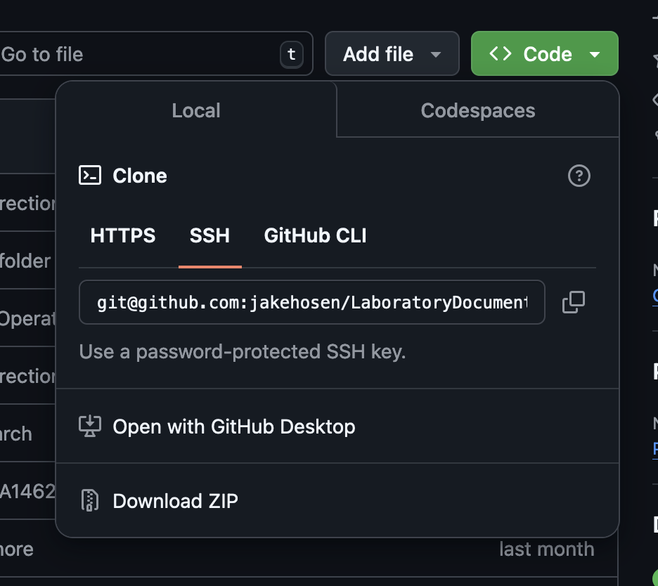

# Installing Git and Github Tools
Git is a program that is used to track changes and collaborate. Github is one of several websites that hosts code repositories that are made using Git. You can use Git just on your computer, but having a cloud tool like Github facilitates collaboration and code sharing.

## Installing Git
### Installing Git for Windows
* Download the latest Git for Windows installer using the link
* Open a terminal program (ideally Windows Powershell) and type ```git version``` to verify that git has been installed.

### Installing Git for MacOS
* MacOS typically has Git pre-installed. You can check to confirm that you have Git installed by opening the terminal and typing ```git version```.
* If you do not have Git installed you can use a package manager called [_Homebrew_](https://brew.sh/) to install Git.
* To install Homebrew, you can run the following command line in the MacOS terminal. If this command doesn't work you can find updated install instructions at the link above: ```/bin/bash -c "$(curl -fsSL https://raw.githubusercontent.com/Homebrew/install/HEAD/install.sh)"```.
* Once you've installed Homebrew, you enter the following command in the terminal: ```brew install git```.

### Installing Git for Linux
* If you're using a Debian Linux distribution (e.g., Ubuntu or PopOS) you can use the following command to install Git: ```sudo apt install git-all```.

## Getting setup with Github.

### Downloading a repository
* To copy a repository (aka _repo_), you go to the repository you want to clone on github (or whatever git repository site you're using) and select the green "code" button. The make sure that '"ssh" is selected and hit the copy button to get the repo link.
* Open a terminal in whatever operating system you are using.
* Type ```git clone``` and then paste the git repo link. Press ```[Enter]```.
<br>
* To switch to a branch you should first type ```git branch -r``` this will get a full list of the remote branches on the github server.
* Type ```git checkout {insert branch name}``` to switch to the branch on which you want to work.
